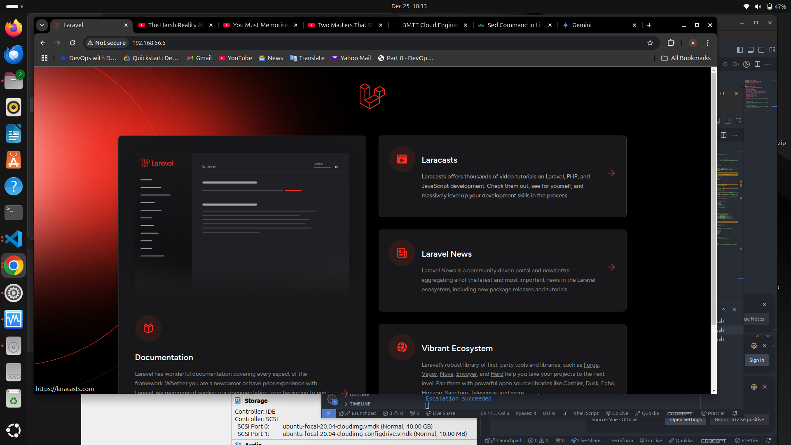

# Automating Laravel Deployment with Ansible


## 1. Set up Vagrant VMs for Master and Slave

## 2. Create ansible playbook file

## 3. Configure bash script


## 4. Adjust the Deployment Script

To ensure the script does not hang during execution:

- Replace commands like `systemctl restart apache2` with `sudo systemctl restart apache2`. Ansible will handle the `sudo` execution if `become` is enabled.

### Example Command Adjustments in Script

```bash
sudo systemctl restart apache2
sudo systemctl enable apache2
```

## Debugging Tips

If the script still hangs, run the playbook with verbose logging to identify where it gets stuck:

```bash
ansible-playbook playbook.yml -vvv
```


## Screenshot
